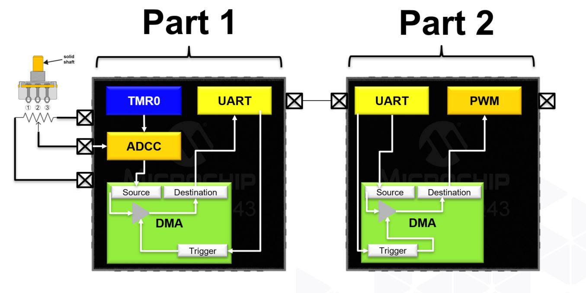
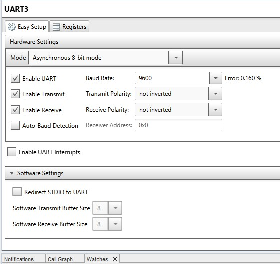
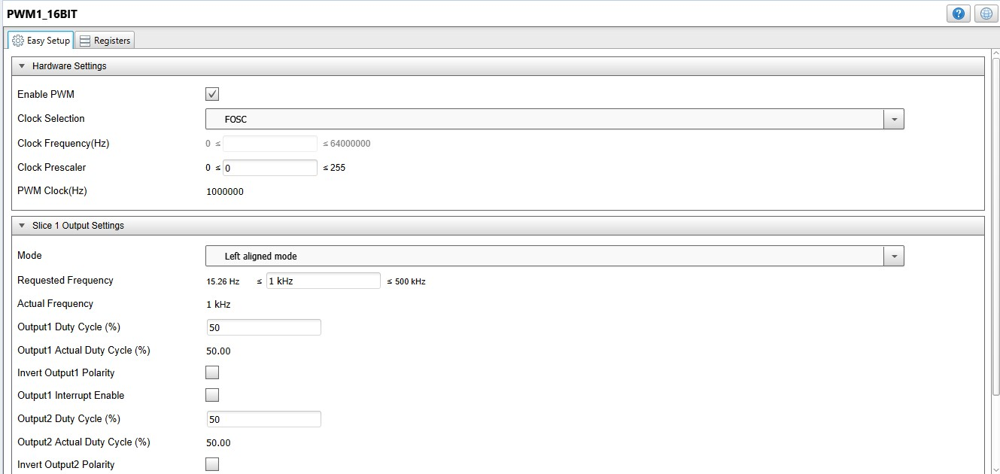
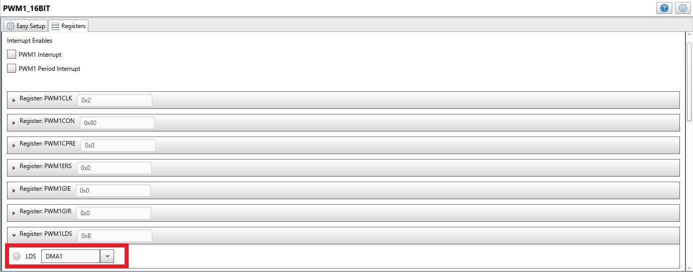
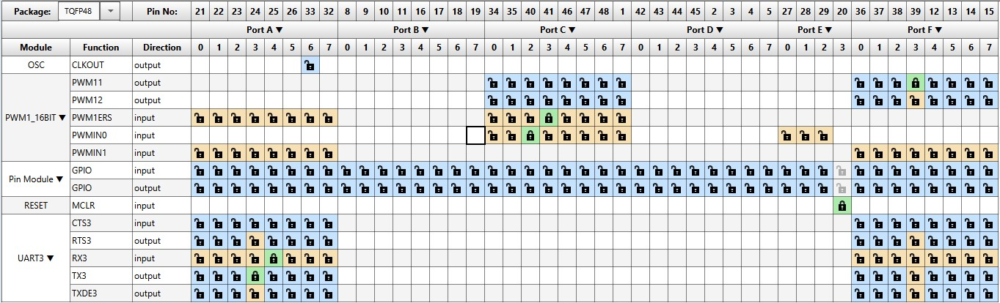
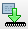

<!-- Please do not change this html logo with link -->

# Direct Memory Access (DMA) on PIC MCUs [Part 2] - UART to PWM

This is part 2 of 2 of an example showing how to set up [Direct Memory Access (DMA)](https://www.microchip.com/design-centers/8-bit/peripherals/core-independent/direct-memory-access?utm_campaign=PIC18FQ43&utm_source=GitHub&utm_medium=hyperlink&utm_term=&utm_content=pic18f57q43-dma-uart-to-pwm-part2-MCU8_MMTCha) using the [Microchip Code Configurator (MCC)](https://www.microchip.com/mplab/mplab-code-configurator?utm_campaign=PIC18FQ43&utm_source=GitHub&utm_medium=hyperlink&utm_term=&utm_content=pic18f57q43-dma-uart-to-pwm-part2-MCU8_MMTCha) on a [PIC18F57Q43 microcontroller](https://www.microchip.com/wwwproducts/en/PIC18F57Q43?utm_campaign=PIC18FQ43&utm_source=GitHub&utm_medium=hyperlink&utm_term=&utm_content=pic18f57q43-dma-uart-to-pwm-part2-MCU8_MMTCha) to transfer data from the devices UART recieve buffer to the PWM duty cycle register to alter the brightness of an LED based on the incoming serial messages from the device we set up in part 1. The data transfer is triggered directly by the hardware UART module when the Rx buffer register is full, meaning we achieve this with zero CPU utilization.

<!-- This is where the introduction to the example goes, including mentioning the peripherals used -->
| Peripherals Used                                              |
|---------------------------------------------------------------|
| Analog-to-Digital Converter (ADC)                             |
| Direct Memory Access (DMA)                                    |
| Pulse-Width Modulation (PWM)                                  |
| Universal Synchronous Asynchronous Serial Transmitter (USART) |

## Related Documentation

- [TB3242: Configuring the DMA Peripheral](https://ww1.microchip.com/downloads/en/Appnotes/90003242A.pdf?utm_campaign=PIC18FQ43&utm_source=GitHub&utm_medium=hyperlink&utm_term=&utm_content=pic18f57q43-dma-uart-to-pwm-part2-MCU8_MMTCha)
- [TB3164: Direct Memory Access on 8-bit PIC® Microcontrollers](http://ww1.microchip.com/downloads/en/AppNotes/TB3164-Direct%20Memory-Access-on-8-bit-PIC-MCU-DS90003164B.pdf?utm_campaign=PIC18FQ43&utm_source=GitHub&utm_medium=hyperlink&utm_term=&utm_content=pic18f57q43-dma-uart-to-pwm-part2-MCU8_MMTCha)
- [AN3312: Arbitrary Waveform Generator Using DAC and DMA](https://www.microchip.com/00003312)
- [AN3382: ADCC Context Switching Using DMA](https://microchip.com/00003382)
- [AN3398: Building Hardware State Machines with CIPs](https://www.microchip.com/00003398)

## Software Used

All software used in this example is listed here:
- [MPLAB® X IDE 5.30](https://www.microchip.com/mplab/mplab-x-ide?utm_campaign=PIC18FQ43&utm_source=GitHub&utm_medium=hyperlink&utm_term=&utm_content=pic18f57q43-dma-uart-to-pwm-part2-MCU8_MMTCha) or newer
- [MPLAB® XC8 2.10 compiler](https://www.microchip.com/mplab/compilers?utm_campaign=PIC18FQ43&utm_source=GitHub&utm_medium=hyperlink&utm_term=&utm_content=pic18f57q43-dma-uart-to-pwm-part2-MCU8_MMTCha) or newer
- [MPLAB® Code Configurator (MCC) 3.95.0](https://www.microchip.com/mplab/mplab-code-configurator?utm_campaign=PIC18FQ43&utm_source=GitHub&utm_medium=hyperlink&utm_term=&utm_content=pic18f57q43-dma-uart-to-pwm-part2-MCU8_MMTCha) or newer
  - [MCC Device Libraries PIC10 / PIC12 / PIC16 / PIC18 MCUs](https://www.microchip.com/mplab/mplab-code-configurator?utm_campaign=PIC18FQ43&utm_source=GitHub&utm_medium=hyperlink&utm_term=&utm_content=pic18f57q43-dma-uart-to-pwm-part2-MCU8_MMTCha)
- [Microchip PIC18F-Q Series Device Support (1.4.109)](https://www.microchip.com/mplab/mplab-code-configurator?utm_campaign=PIC18FQ43&utm_source=GitHub&utm_medium=hyperlink&utm_term=&utm_content=pic18f57q43-dma-uart-to-pwm-part2-MCU8_MMTCha) or newer

## Hardware Used
- **PIC18F57Q43 Curiosity Nano** [(DM164150)](https://www.microchip.com/Developmenttools/ProductDetails/DM164150?utm_campaign=PIC18FQ43&utm_source=GitHub&utm_medium=hyperlink&utm_term=&utm_content=pic18f57q43-dma-uart-to-pwm-part2-MCU8_MMTCha)
  - **NOTE:** There is second device used in [part 1](https://github.com/microchip-pic-avr-examples/pic18f57q43-dma-adc-to-uart-part1)
- **Potentiometer (x1)** - used in [part 1](https://github.com/microchip-pic-avr-examples/pic18f57q43-dma-adc-to-uart-part1)
- **[Optional]** Curiosity Nano Base for Click boards™ [(AC164162)](https://www.microchip.com/Developmenttools/ProductDetails/AC164162?utm_campaign=PIC18FQ43&utm_source=GitHub&utm_medium=hyperlink&utm_term=&utm_content=pic18f57q43-dma-uart-to-pwm-part2-MCU8_MMTCha) - this was used in lieu of a breadboard.

## Setup

The hardware is setup as shown in more detail in [**this video**](https://www.youtube.com/watch?v=Wz7gt11gpSw). Below is a diagram of the specific pins used. You'll notice the Curiosity Nano Baseboard for clicks is missing from this diagram as they were only used as alternative to a breadboard in this cases

| Potentiometer | Q43 (part 1)      |               | Q43 (part 2)|
|---------------|-------------------|---------------|-------------|
|        +      |    3.3V           |               |             |
|       gnd     |    gnd            |               |             |
|   output      |    RA0            | (Yellow Wire) |             |             
|               |    RA3 (UART3 TX) | -----------> |    RA4 (UART3 RX)  |             |

## Operation & Summary

As noted before - this is part 2 of 2 of an example showing how to set up [Direct Memory Access (DMA)](https://www.microchip.com/design-centers/8-bit/peripherals/core-independent/direct-memory-access?utm_campaign=PIC18FQ43&utm_source=GitHub&utm_medium=hyperlink&utm_term=&utm_content=pic18f57q43-dma-uart-to-pwm-part2-MCU8_MMTCha) using the [Microchip Code Configurator (MCC)](https://www.microchip.com/mplab/mplab-code-configurator) on a [PIC18F57Q43 microcontroller](https://www.microchip.com/mplab/mplab-code-configurator?utm_campaign=PIC18FQ43&utm_source=GitHub&utm_medium=hyperlink&utm_term=&utm_content=pic18f57q43-dma-uart-to-pwm-part2-MCU8_MMTCha) to transfer data from the devices UART recieve buffer to the PWM duty cycle register to alter the brightness of an LED based on the incoming serial messages from the device we set up in [**part 1.**](https://github.com/microchip-pic-avr-examples/pic18f57q43-dma-adc-to-uart-part1)

## Walkthrough

### Create New MPLAB X Project and Open MCC
1. Same as before in [part 1](https://github.com/microchip-pic-avr-examples/pic18f57q43-dma-adc-to-uart-part1), but restated here for clarity.
2. Open the MPLAB X IDE
3. Create new project by clicking the icon:    
   1. Alternatively: file >> New Project
4. In **Choose Project** window
   1. Select **Microchip Embedded** category
   2. Select **Standalone Project**
   3. Hit **Next>**
5. In **Select Device** window
   1. Select **PIC18F57Q43** as your device
   2. Pro-tip: quickly filter for devices by inputting the last 3-4 characters of the device name and then selecting from the drop-down list (e.g. Q43).
   3.  Hit **Next>**
6.  In **Select Tool (Optional)** window
    1.  If device is connected – select Microchip Kits -> PIC18F57Q43 Curiosity Nano (PKOB nano)
    2.  If not, you can do this later when programming the device.
    3.  Hit **Next>**
7.  In **Select Compiler** window
    1.  Select XC8 (v2.10)
    2.  Hit **Finish**

### Configure MCC
8. In **System Module** window
9. Set **Oscillator Select** to **HFINTOSC**
    1. While this example uses a system clock of 1MHz, it should be noted that any larger value for the system clock should provide similar results.
10. Under **Device Resources** left-hand pane
    1.  Open the **Peripherals** drop-down
    2.  Double-click the (PIC10/PIC12/…) instance of the PWM and USART3 peripherals to add them your project.

11. In UART window/tab
    1.  Set baud rate to 9600

12. In the **PWM window** / Easy Setup tab
    1.  Check the box next to **Enable PWM**
    2.  In the **Registers tab**, Set **PWM1LDS to DMA1**
    3.  **Warning:** Make this change only after doing the previous step where you configure the model in the Easy Setup window.

13. In the **Pin Manager: Grid View** window, connect pins:
    1.  RX3 -> A4
    2.  TX3 -> A3 (not needed necessarily since we are just receiving)
    3.  PWM -> RF3 (pin tied to CNano board LED0 as per schematic)

14. In the **DMA window** manager
    1.  Enable DMA CHANNEL 1 and make the changes shown in the table and screenshot below with explanations

|     | Module    | Region | SFR     | VarName | VarSize | Address | Mode      | Message Size | Start Trigger | Abort Trigger |
|-----|-----------|--------|---------|---------|---------|---------|-----------|--------------|---------------|---------------|
| Src | UART3     | SFR    | U3RXB   | -       | -       | -       | unchanged | 1            | U3RX          | None          |
| Dst | PWM_16bit | SFR    | PWMS1P1 | -       | -       | -       | increment | 2            | (see above)   | (see above)   |

15. What we just did:
    1.  **UART3** is the data **source module** of DMA channel 1
    2.  **U3RXB** is the **SFR (Special function register) region** that we want data to be sourced from.
    3.  The **U3RXB SFR register is 1-byte**, therefore the **mode is unchanged** since we don’t need to increment over multiple bytes or registers.
    4.  Similarly, the **UART RX Buffer is 1-byte**, so we need to indicate that the **message size is 1-byte**
    5.  **PWM1_16bit** is the data destination module, with the **PWM1S1P1L** being the specific destination SFR.
    6.  The PWM period register is 16-bits, meaning we will need to **increment** in order to load both the low register that we started with and the PWM1S1P1H (high), which also means our **message size is 2**-bytes since we are loading two 8-bit registers.
    7.  Set the DMA **start trigger** to fire every time the RX Buffer is full (**U3RX**).
    8.  **NOTE**** - we did not need to set VarSize, VarName, and Address parameters as these are only required when working with user-defined values in memory as opposed to fixed SFRs in this case.
16. Hit **Generate Project** and
17. Hit **Program the device** 

## Conclusion
There you have it. You just implemented some systems coms, automatic memory operations, and waveform without writing any lines of code. Feel free to build on the project as you see fit, find more detailed applications in the documents linked in the [**resource section**](#related-documentation), or check out other code examples in the repo.
